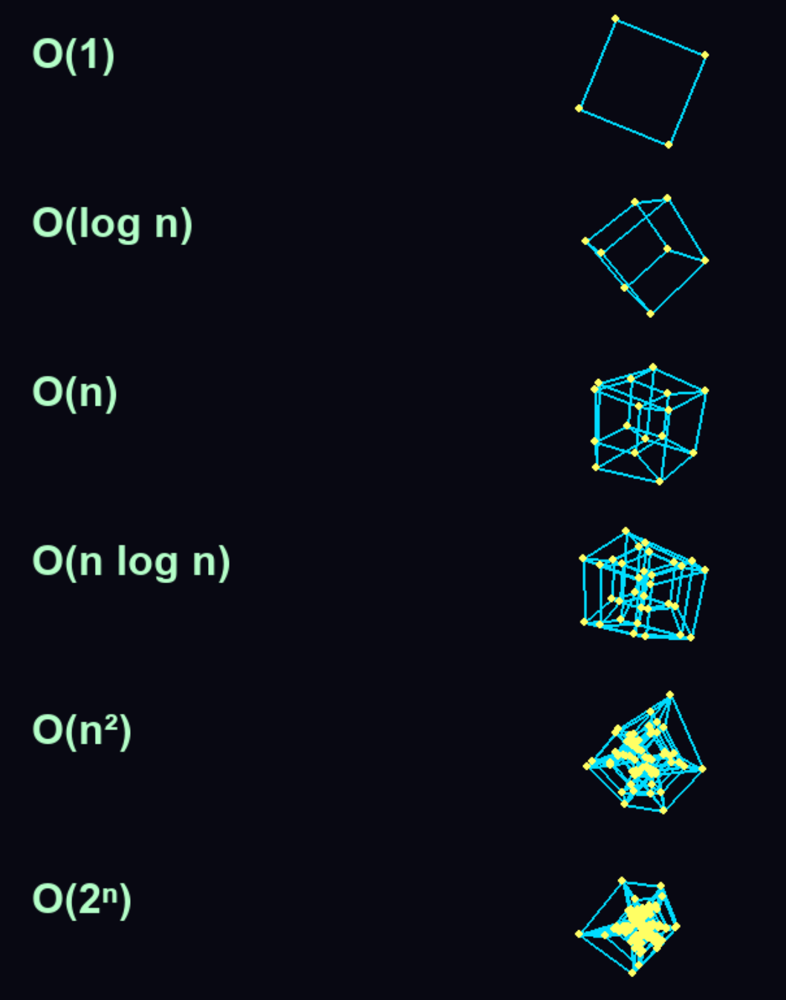

# 7d-complexity-visualizer

A visualizer for Big-O notation complexity

Inspired by [this phantastic tweet](https://x.com/stemexplor/status/2033337219281207467) or rather [this video](https://youtu.be/effIaRawUdA) (thanks Prime), I thought to myself, I guess it's up to me now to make the next move. Rolling balls is clearly not enough anymore. So I created this animated multidimensional hyper-cube visualization.

Here's what it looks like as a screenshot:

Image of the one from "S.T.E.M Explorer":

%20Complexity%20visualiser.png)
